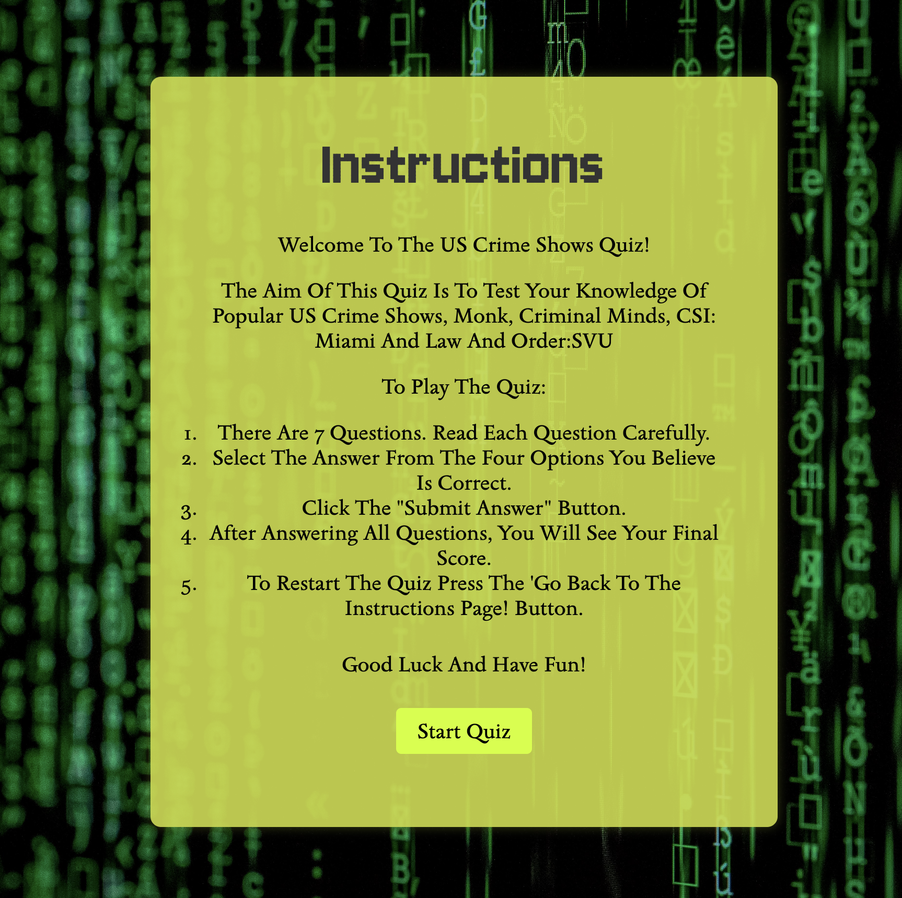

# US Crime Shows Quiz

## General Overview

The site is aimed people interested in testing their knowledge of popular fiction crime shows with questions related to specific episodes, characters and actors. The site includes an instructions page ensuring end users understand how to play the quiz and what to expect as they enter the quiz area. 

You will see on the website the use of typical crime show colours and fonts learnt through my own experiences watching crime shows and partaking in similar quizes as research towards this project. 

The site has a clean, simple design with a green, black and white colour pallete to match the asthetic of crime shows like CSI: Miami.

## Website Purpose, Goals and Target Audience

What the US Crimes Show Quiz hopes to accomplish:

1. The aim of the US Crime Shows Quiz is to test the knowledge of popular crime shows fanatic in a fun, interactive and simple way.

Intended user targets:

1. A website aimed at users who want to play an online quiz to test specific knowledge on popular US Crime shows.
2. A fun interactive website that allows users to learn about US crime shows they may not have heard about before.
3. Experience a challenging quiz which provides entertainment.

How is it useful for the intended users:

1. This quiz tests users knowledge in a fun, easy and entertaining way making it easier to capture and retain the users attention.
2. The website allows users to learn about several different shows rather than a typical quiz which may focus on one show. This is useful as users may want to increase their overall knowledge rather than specific when it comes to Crime Shows.
3. The functionality that allows for feedback makes this a useful quiz as it not only tests users knowledge but users are also able to learn more about these shows as they go through the quiz.

 

## FEATURES

In this section, you should go over the different parts of your project, and describe each in a sentence or so. You will need to explain what value each of the features provides for the user, focusing on who this website is for, what it is that they want to achieve and how your project is the best way to help them achieve these things.

### Navigation Bar
* There are simple navigation options as you can see below. 

Option 1 - start the quiz after reading the instructions.
Option 2 - go back to the instructions start page.
Option 3 - submit answer.
Option 4 - next question.
Option 5 - go back to previous question.

* These options will allow users to easily navigate fromm page to page across all devices without having to click the 'back' button on the browser. 

### Instructions Page
* The landing page includes an overlay of a typical CSI:Miami lab based background with a green instructions container overlay. This allows users to connect the quiz to typical crime shows with the aim of creating an enhanced UX as they connect the colour scheme and fonts chosen to various popular crime shows. 

* As the user enters the site they see the instructions at first glance and are able to avoid spoilers of the questions. The text on this instruction page is simple and kept to a minimum 

*This ensures users are well informed before choosing to start the quiz on key aspects such as, the number of questions, the topics that the quiz will test and where to go should they forget the instructions.

### Quiz Page

* This section includes the quiz questions controlled by the user through a simple 'submit answer', 'next question' and 'go back to previous question' buttons.

* Users will get the opportunity to pick answers from a multiple choice selection which supports seasoned crime show viewers and newer fanatics to test their knowledge without too much pressure.

### Quiz Feedback 

* To ensure users are learning from the quiz, feedback based on users answers will be provided with a simple 'Correct!' message or 'Incorrect, the correct answer is ...' message.

* This feature is important as the aim of the website is to learn and test your knowledge on these crime shows which wouldn't be possible without a feedback option.

### Congratulations Page

* At the end of the quiz a 'congratulations' message is displayed notifying users of their score and giving users a choice to retake the quix. 
* This feature is important as it encourages users to try again and also provides a positive message reiterating that they've done a great job and they'll want to try again until they recieve a 7/7 score.

### Question Counter 

* The question counter allows users to keep track of the question they are currently on, this simply updates as the user clicks 'next question'.

* This will encourage users to carry on with the quiz as they build their excitement to find out their final score and next steps.

## Features left to implement 

* A feature i'd like to implement is the ability to play against multiple people, making the quiz more interactive, if users are able to create profiles that keep track of their current scores and their pogress against their competitors, this should enourage users to stay connected with the website. 

* Another feature which I would like to implement is an option for more questions. Currently the quiz is interactive and provides questions on several shows, adding more shows and questions will encourage users to stay on the site and carry on testing their knowledge and learning more about this topic.

## Testing

### Validator testing
* HTML - No errors were found when passing through the official WSC Validator.

* CSS - No errors were found when passing through the official Jigsaw W3 Validator.

* JS - No errors were found when passing the javascript code through the official JSHint tool.

### Manual Testing

* To manually test the site I first sent the deployed link to several different family and friends devices to see how the site behaved on different size browsers as a form of 'market research'. The site worked well and there were no major issues. The one issue that seemed to happen on very small devices like an iPhone Mini is the instructions button would ever so slightly overlap with the quiz container. This did not affect the quality of the quiz as users were still able to get full functionality and visibility but it would've made for a better experience had the button not overlapped. 

* Following feedback from assesors, I had realised there were some issues with the HTML files with stray symbols and unused functionality. I put all files through the W3C validator to ensure all errors were picked up and that the formatting of the code was correct as well. The images above show the positive output from these validators. 

* When building the site I made sure to pull the site through to the browser so I could see changes I made in real time. As I made major updates to the file I would periodically use the 'inspect' option in the browser, specifically the 'console' option to step through each functioning part of the site to make sure it did not bring up any unidentitifed issues. I went through this step multiple times until no issues were flagged. 

### Unfixed Bugs
* Minor bug with slight overlapping of the instructions button on very small screens. Functionality and user experience were either not disrupted or was very minimally affected.

## Version Control
To ensure version control the following commands were used to ensure all features were deployed into the live site:

* git add . - adds files reay for 'git commit -m'
* git commit -m "message" - to commit the code to local repository ready for 'git push'
* git push - final command used to push code to repository.

## Deployment
The site was deployed to GitHub Pages. Please follow the steps below to deploy:
* Go to Github repo > "Settings" > "Code and automation" > "Pages" > "Source" to be set to 'Deploy from Branch' > "Main branch" to be selected > "folder" set to root 
* Click "Save"
* Wait until you can see a link for deployed page within Github Page section, this can take a while. In the 'Environments' section then click "View Deployment. The URL will look similar to my website below.

![Website-Link]

## Technologies Used
* Favicon.io - used to create favicon for the page
* Visual Studio Code - used to develop the website
* Github - used to host source code and deploy on Github Pages
* Gitpod - used to write, commit and push code 
* HTML - used to create main content of the website
* CSS- used for website styling
* Tiny PNG- used to compress the size of images
* UI.Dev- used for creating mockup image
* W3C Validator- used for checking HTML and CSS for errors
* Site24x7 - used for checking JS for errors
* Funtrivia. com - used to pull quiz data from, signposted within code.

## Credits
* Google fonts
* pexels.com - for all open source images used.
* W3C Validator - to check all code was correct.
* Site24x7 - to check all code was correct.
* Following youtube videos on creating an interactive site - https://www.youtube.com/watch?v=rFWbAj40JrQ&list=PLB6wlEeCDJ5Yyh6P2N6Q_9JijB6v4UejF
* Student support on Slack.
* Personal mentor support in general but specifically on JS code.
* Love Maths project - for general help
* Funtrivia.com for all quiz related questions.
* Font Awesome - for all icons used.
* Google images for the background image
* Code insitute course to supplement my understanding of JS alongside outside sources mentioned above.
* Feedback from original markers on what should be improved.